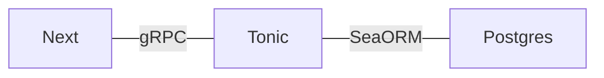

作成中なので今後も加筆修正が行われます。

# 構成

Rustを中心にWebシステムを構成したいと思いデモ的なシステムを作成した。

ソースコードは以下のレポジトリで公開している。

https://gitlab.com/takatan/demo-grpc-nextjs-tonic

バックエンドにRustで作成してフロントエンドをTypeScript(NextJS)で作成するシステムを作る。
フロントエンドとバックエンドの間の通信はgRPCで行う。
フロントエンドをRustで書くこともできるがそこはあまり難しいことをしないで一般的な技術を使うこととした。

## バックエンド

gRPCのバックエンドはRustで作成する。gRPCはtonicを使う。

https://github.com/hyperium/tonic

またデータベースを利用するがその部分はSeaORMを使用する。

https://www.sea-ql.org/SeaORM/

## フロントエンド

NextJSを使う。
ユーザーエージェント側には通常のHTTPで接続させてgRPCはバックエンド側との通信のみに使う。

## gRPC

gRPCを使う理由はOpenAPIで自分でプロトコル設計をするのも手間なのでgRPCのレイヤーに乗せてしまいたいからである。

gRPCの接続部分はスキーマからソースコードを生成する形になる。